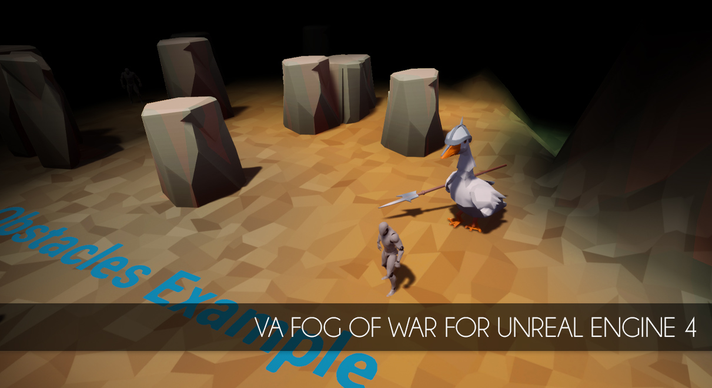

[/statusIcon.svg)](https://teamcity.ufna.dev/viewType.html?buildTypeId=UfnaDev_VaFogOfWar_ClangFormatCheck&guest=1)

# VaFogOfWar

A clear and simple solution of Fog of War for Unreal Engine 4.

**VaFogOfWar** implements fast and optimized fog of war solution for topdown games like Dota, StarCraft or League of Legends. It fast enough even to work on mid-end mobile devices, so it works like a charm on desktop.

Check [wiki](https://bit.ly/VaFogOfWar-Docs) for usage examples and development notes.

### Main features

- Three types of layers: current visibility, global visibility (permanent from black), terrain
- Eight height levels supported (river, lowground, highground, etc.)
- Dynamic and static obstacles (trees, rocks, etc)
- Different types of radius strategy: circle, square and others
- Freeform fog blocking volumes as tool for terrain level painting
- Initial terrain levels can be set with heightmap

### Release notes

Plugin is released for free without any limitations, you can use it and modify as you want. Feel free to post your comments and feedback.

Demo content is not provided, but it's released as separate paid demo project here: https://gum.co/TFflr . It's also planned to be released at the Unreal Marketplace a bit later.

## Legal info

Unreal® is a trademark or registered trademark of Epic Games, Inc. in the United States of America and elsewhere.

Unreal® Engine, Copyright 1998 – 2019, Epic Games, Inc. All rights reserved.

